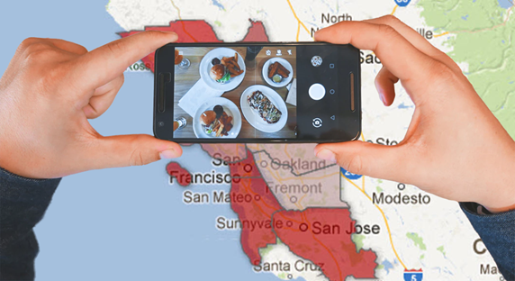
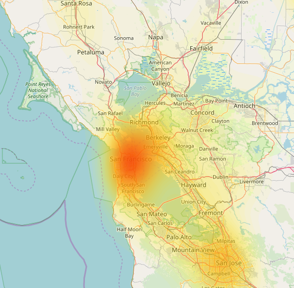
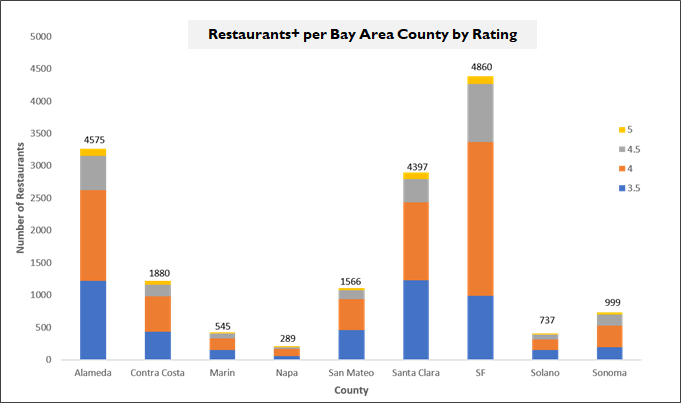
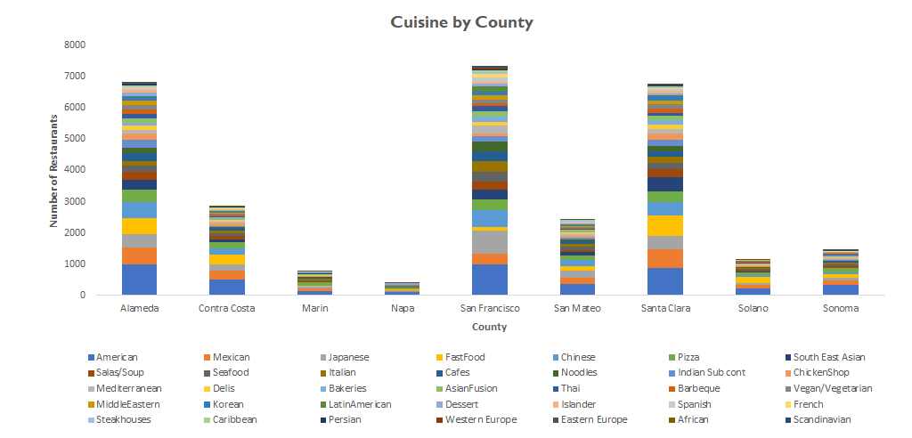

# ALL FOOD IN THE HOOD

  
   

## OVERVIEW
Data analysis project ranking food scenes of Bay Area counties. Created using Yelp API, Jupyter Notebook, Pandas, & Matplotlib.

By: Phillip Choi, Carly Russell, Natalie Stanislov, Loba Quasem

<a href="All food in the hood.pptx">Powerpoint Presentation</a>

  An introductory exploration of extracting and visualizing data from APIs. The main goal of this study is to identify and  recommend best neighborhoods for dining in a vast Bay Area. Due to time constraints of the project, scope was limited to San Francisco & surrounding areas at the county level.
  

    
     
    <b>Heat map of highest concentrations of restaurants in the Bay Area</b>
  

  
   
    <b>Final chart compares counts of restaurants rated 3.5 and above</b>
   
   
   
  
   
    <b>Supplemental chart segments by cuisine type to show variety</b>

